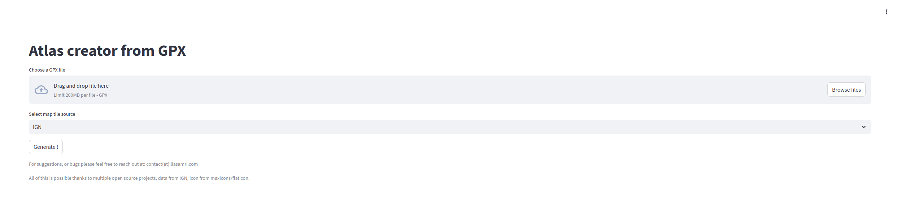
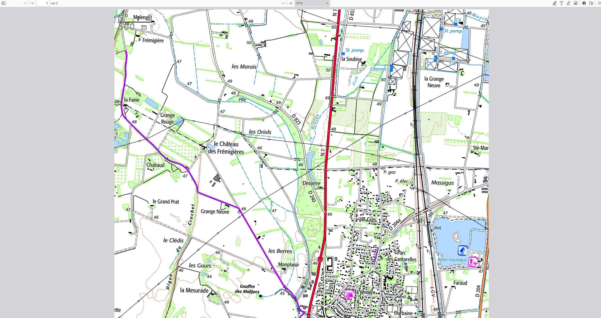
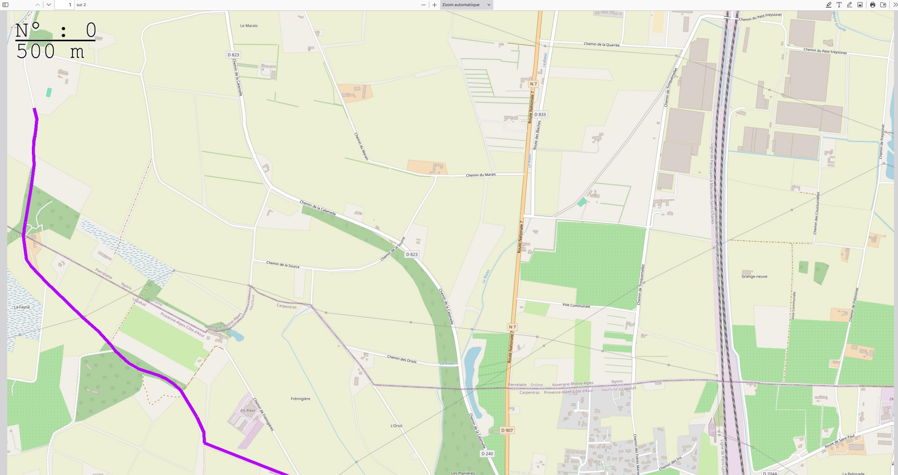

# GPX to Map PDF Generator

Converts GPX tracks into printable PDF atlases with multiple map tile sources (IGN, OpenStreetMap, OpenTopoMap).

## Features

- Multiple map sources: IGN (France), OpenStreetMap (worldwide), OpenTopoMap (topographic)
- Automatic page generation with chronological ordering
- Navigation markers showing next/previous page locations
- Customizable track color
- Scale bars and page numbers
- Asynchronous tile fetching for performance

## Screenshots





## Quick Start

### Using the Web Interface

Visit the hosted interface and upload your GPX file.

### Using the API

```bash
curl --location --request POST 'SERVERLESS_ADDRESS' \
     --form gpx_file=@"./your_track.gpx" \
     --form _tile_source="OSM" \
     --form _line_color="#B700FF" \
     --output map.pdf
```

### Local Development

```bash
# Install dependencies
pip install gpxpy numpy pandas pyproj Pillow aiohttp tqdm streamlit

# Run frontend
streamlit run frontend.py

# Deploy backend to Modal
modal config set-environment main
modal deploy modal_backend.py
```

## Testing

The project includes comprehensive unit tests for the page generation algorithm.

```bash
# Run unit tests
python -m pytest tests/test_page_generation.py -v

# Run full test suite with profiling
python run_full_test.py
```

Tests verify:
- Chronological page ordering
- No duplicate tiles across pages
- Proper tile grouping
- Navigation marker placement

## How It Works

1. **Parse GPX**: Extract GPS points from track
2. **Convert to Tiles**: Map GPS coordinates to map tile coordinates
3. **Group Pages**: Group nearby tiles into 9x14 page grids
4. **Fetch Tiles**: Download map tiles from selected source (OSM/IGN/TOPO)
5. **Draw Track**: Overlay GPS track on map tiles
6. **Add Markers**: Add navigation arrows, page numbers, and scale
7. **Generate PDF**: Combine pages into printable PDF

## Configuration

Map tiles are fetched at zoom level 15 for IGN, OSM, and OpenTopoMap. Each page contains a 9x14 grid of 256x256 pixel tiles.

## Architecture

- Frontend: Streamlit web interface
- Backend: Serverless computation using Modal
- Processing: Asynchronous tile fetching and PDF generation

## Contributing

Contributions welcome. Please ensure tests pass before submitting pull requests.

```bash
pytest tests/test_page_generation.py
```

## Task List

- [x] Configure 14 images per A4 paper sheet
- [x] Fix bug with saving the same image for TRACE
- [x] Fix offset issues
- [x] Move key to environment variables
- [x] Add page numbers and scale
- [x] Add PDF export functionality
- [x] Performance optimization with async processing
- [x] Implement UI
- [x] Add progress bar with sttqdm
- [x] Make color and line thickness configurable
- [ ] Add Portrait/Landscape orientation choice
- [ ] Make number of tiles variable
- [ ] Add A4/A3 paper size options
- [x] Clean and refactor codebase
- [x] Optimize by fetching all page images at once
- [x] Add choice between OSM and IGN maps
- [ ] Add optional legend page
- [x] Add choice of color for the Trace
- [x] Add Open Topo Map
- [ ] When multiple segments of gpx but unrelated, they are still connected
- [ ] Check if the scale is always correct

## License

See LICENSE file.

## Contact

For suggestions or bug reports, please open an issue.
