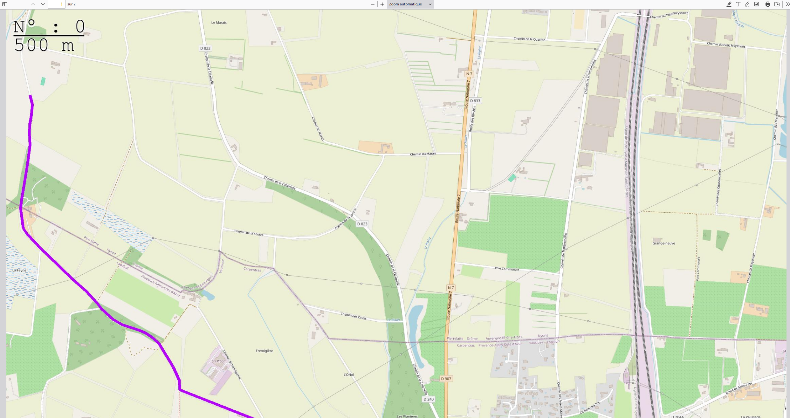

# GPX to Map PDF Generator

A simple tool that converts GPX tracks into beautiful PDF maps using IGN (French National Geographic Institute) tiles.

## Screenshots




## Architecture

- Frontend: Web interface hosted on a private VPS
- Backend: Serverless computation using Modal
- Processing: Asynchronous tile fetching and PDF generation

## Quick Start

### Using the API Directly

```bash
curl --location --request POST 'SERVERLESS_ADDRESS' \
     --form gpx_file=@"./your_track.gpx" \
     --output map.pdf
```

### Deploying the Backend

1. Set up Modal environment:
```bash
modal config set-environment main
```

2. Deploy to Modal:
```bash
modal deploy modal_backend.py
```

## Task List

- [x] Configure 14 images per A4 paper sheet
- [x] Fix bug with saving the same image for TRACE
- [x] Fix offset issues
- [x] Move key to environment variables
- [x] Add page numbers and scale
- [x] Add PDF export functionality
- [x] Performance optimization with async processing
- [x] Implement UI
- [x] Add progress bar with sttqdm
- [x] Make color and line thickness configurable
- [ ] Add Portrait/Landscape orientation choice
- [x] For some reason there is no deploy.sh
- [ ] Make number of tiles variable
- [ ] Add A4/A3 paper size options
- [ ] Deploy a small pocketbase or sqlite for GPX file storage
- [ ] Add optional grid overlay
- [ ] Clean and refactor codebase
- [x] Optimize by fetching all page images at once
- [x] Add choice between OSM and IGN maps
- [ ] Add optional legend page


## Contributing

Feel free to open issues or submit pull requests.

## Contact

For suggestions or bug reports please open an issue.
